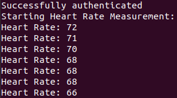

### Heart rate monitor for Mi Band 6 and 7

This is a Python implementation of the [miband-6-heart-rate-monitor](https://github.com/gzalo/miband-6-heart-rate-monitor) 

**Real time heart rate monitor for Mi Band 6 and 7 using Python**

Note: Currently Mi Band 7 is not working properly



## Requirements

1. Install dependencies:
```
sudo apt-get install libglib2.0-dev
pip3 install -r requirements.txt
```
2. Clone [tiny-ECDH-python]()
3. Copy ecdh.python and utils.py files from the tiny ECDH to this repository
4. Find gatt_linux.py on your computer (Should be on /home/user/.local/lib/python3.8/site-packages/gatt)
5. Make the following changes on the file gatt_linux.py:
```
Class DeviceManager:

    # Add the following function to the Class
    def notification_query(self, function, device):
        GObject.timeout_add(10000, function, device)

Class Device:

    # Change the following function 
    def _connect(self):
        self._connect_retry_attempt += 1
        try:
            self._object.Connect()
            # Only this line is changed, remove the rest. Some bug doesn't allow to connect with Band 7
            if not self.services:
                self.services_resolved()
```

## How to use

1. Clone this repository
2. Find your Mi Band's Authentication Key ([Check Here](https://codeberg.org/argrento/huami-token))
3. Put your authentication key to `auth_key.txt` file in the current directory. 
4. Turn off Bluetooth on your mobile device paired with the band
5. Find out your band MAC address using bluetoothctl
```
sudo bluetoothctl
scan on
devices
```
6. Run main script
```
python3 main.py -m MAC_ADDRESS -b 6
``` 

## References

- [gzalo/miband-6-heart-rate-monitor](https://github.com/gzalo/miband-6-heart-rate-monitor)
- [patyork/miband-7-monitor](https://github.com/patyork/miband-7-monitor) 
- [Jaapp-/miband-5-heart-rate-monitor](https://github.com/Jaapp-/miband-5-heart-rate-monitor)
- [satcar77/miband4](https://github.com/satcar77/miband4)
- [vshymanskyy/miband-js](https://github.com/vshymanskyy/miband-js)
- [vshymanskyy/miband2-python-test](https://github.com/vshymanskyy/miband2-python-test)
- [VladKolerts/miband4](https://github.com/VladKolerts/miband4)
- [Gadgetbridge](https://codeberg.org/Freeyourgadget/Gadgetbridge)

## Libraries

- [tiny-ECDH-python](https://github.com/danielsousaoliveira/tiny-ECDH-python)
- [gatt-python](https://github.com/getsenic/gatt-python)
- [pycryptodome](https://github.com/Legrandin/pycryptodome)

## TODO

1. Add continuous heart rate measurement to Mi Band 7 class
2. Add alarm functionality to Mi Band 7 Class
3. Implement spo2 measurement